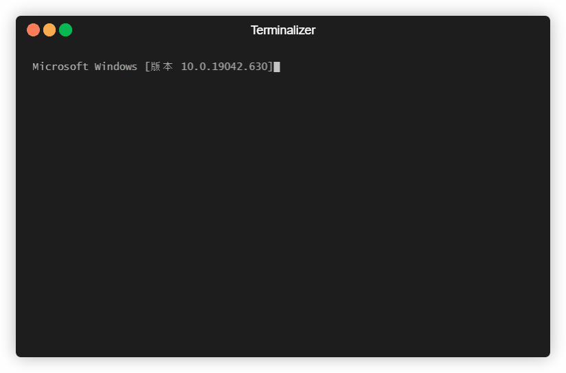

# python.ts: Embed and run Python code in NodeJS

嵌入 Python 到 NodeJS 中, 使得 NodeJS 中可以调用任意 Python 模块和方法



主要用于在 Electron 项目中方便加载基于 Python 的插件

相比于基于 RPC 方式的插件调用机制，`python.ts`的**优势**如下

- 更快的速度, 约 20W+/s 的单函数调用速度 (得益于去除了 TCP/序列化的开销)
- 降低内存占用, 使用 C++多线程而不是多进程, 可共享内存数据
- 更丰富的 Python 对象呈现, 比如可以使用循环字典 Circular Dict 等难以序列化的对象类型
- 更友善的 API, 见 Usage
- 彻底的资源隔离, 通过 Sub-Interpreter 机制实现比 exec(code, context)更为彻底的资源隔离
- 没有 GIL: 等 Python3.10 做好 Sub-Interpreter 的真隔离后, 调用 Python 代码可以真-多线程了

不过也有**劣势**如下

- 64 位 node 无法调用依赖 32 位的 Python 模块

## Usage

1. 安装

   **A）在 Windows 下**，确保安装了Python（官方安装包，建议安装到C:\Python39，以免踩node-gyp编码的坑），确保安装了Visual Studio 2017以上，并安装了C++开发环境。
   
   然后下载 [Python3.8-Windows-x64.zip](https://github.com/observerss/python.ts/releases/download/v0/python3.8-windows-x64.zip) 把文件解压到当前目录下的`x64`目录, 确保存在`x64/python38.dll`文件

   ```bash
   npm install -g yarn
   yarn
   ```
   
   如果编译失败，也可以下载预编译的x64版本的 [python-ts.node](https://github.com/observerss/python.ts/releases/download/v0.3.2/python-ts.node) ，放入`build`目录，一样可以用

   **B）在 \*NIX 系统下**, 用 Docker 会轻松一点, 否则 Python 因为系统自带, 多版本的时候管理起来有点麻烦, 详见 [Pitfalls](#pitfalls) 部分的说明

   ```bash
   docker build -t python.ts .
   docker run --rm -it python.ts

   # now in docker
   npm install -g ts-node
   ts-node
   > import {Python} from '.'
   > let py = new Python()
   ```

2. 使用标准库

   ```typescript
   import { Python } from "./src/python";

   let options = {
     runtime_path: "x64",
     debug: false,
     context: false,
   };
   let py = new Python(options);
   let sys = py.import("sys");
   console.log(sys.version);

   let os = py.import("os");
   console.log(os.listdir());
   ```

3. Plugins/第三方代码

   添加 syspath 之后就能引入第三方代码了

   ```typescript
   py.add_syspath("plugins");
   let excelModule = py.import("Excel");

   // 当返回值是一个python对象的时候, 可以调用unwrap，从python获取method和attr
   let xls = excelModule.Excel().unwrap();
   xls.open_workbook("tests/test.xlsx");
   let cell = xls.read_cell(0, 0);
   console.log("cell is", cell);
   ```

4. 直接执行 Python 的代码

   ```typescript
   py.exec(`def f(a, b):
      return a + b
   `);
   console.log(py.eval(`f(1, 2)`));
   ```

   其中

   - `py.exec`可以接受多行代码, 但不返回值
   - `py.eval`只能接受表达式, 并返回结果

5. 上下文隔离: Experimental

   创建 py 对象的时候可以传递 context 的参数来选择是否想要进行上下文隔离

   ```typescript
   let py1 = new Python({ context: true });
   let py2 = new Python({ context: true });
   let os1 = py1.import("os");
   let os2 = py2.import("os");
   let inspect1 = py1.import("inspect");
   let doc1 = inspect1.getdoc(os1);
   inspect1.getdoc(os2); // error!
   ```

6. 异步调用

   以上调用方法为同步调用，会阻塞 Javascript 的主执行进程。

   如果不希望阻塞主进程，则需要采用异步调用方法。

   ```typescript
   let Dummy = py.import("Dummy");
   let dm = Dummy.Dummy().unwrap();

   // 同步方法
   let r1 = dm.dummy();

   // 异步方法, 同步方法后面+`_async`即可
   let r2 = await dm.dummy_async();
   ```

   注意，第一次调用异步方法时, 因为需要初始化 nodejs 的`worker_threads`, 需要等待一些时间, 这是正常的

   另外`call`, `exec`, `eval`也有各自的 async 版本

   - `py.call_async(pyobject, method, args)`
   - `py.exec_async(code)`
   - `py.eval_async(code)`

   使用方法可以参考测试用例以及源码

7. 资源回收

   所有返回的 Python 对象都会保存在`clib.references`里面，以防对象被 Python 回收

   如果能确保某些对象是无用的，可以这样回收

   ```typescript
   py.gc(obj);
   ```

   如果要回收本上下文创建的全部资源，可以这么做

   ```typescript
   py.clear();

   // 上下文对clear的影响如下
   let py1 = new Python();
   let py2 = new Python();
   let py3 = new Python({ context: true });

   // py2下创建的对象也会被清空, 因为它们共享一个全局上下文
   // py3下创建的对象不会被清空, 因为它们使用不同的上下文
   py1.clear();
   ```

   注意

   - 被清除的 obj 必须是 PyWrapper 或者 Unwrapped 类型
   - 只能回收本上下文创建的对象, 这个限制是为了避免混乱, Python 侧其实没有这个限制
   - 如果一个对象后续还会用到，但是被回收了，那么执行结果会难以预测

8. 销毁 Python

   销毁 Python 将导致所有载入的功能全部失效，需要全部重新加载

   本方法可以用于应对无法挽回的 Python 侧(C 模块)内存泄露

   ```typescript
   import { clib } from "./src/python";
   clib._destroy_python();
   ```

## Benchmark

执行以下脚本可以测试调用性能

```shell script
ts-node tests\bench.ts
```

在 i7-9700K(3.6Ghz->4.9Ghz)的电脑上执行情况如下

```shell script
import function call 1000 times in 280 milliseconds => qps = 3571.4285714285716
dummy function call 100000 times in 510 milliseconds => qps = 196078.431372549
excel function call 10000 times in 296 milliseconds => qps = 33783.78378378379
async function call 10000 times in 317 milliseconds => qps = 31545.741324921135
```

## Build & Test

1. Build

   ```bash
   npm run build
   ```

2. Test

   ```bash
   npm run test
   ```

## Compares

和已有相似开源库的比较

### `Python.Js`

- <https://github.com/monkeycz/python.js>

这个项目已经很久了，主项目已经渐渐不 work 了, 所以有好几个分支, 最新的一个 fork 是这个 [python.node](https://github.com/JonathonRP/python.node)

这个系列写于 NodeJS 还没有稳定的 CAPI 的时候，所以基本上是用 v8 为基础来改的，**优点**是

- 可以做一些骚操作，比如类似 Python 中`__getattr__`这样的操作, 实现动态方法。
- v8 的基础类型(Handle?)和 PyObject 的互换兼容性更好

**缺点**的话，

- 无法确保二进制兼容性, Node 升级一版可能就得跟着修修补补
- 无法异步调用, Python 中哪怕一个`time.sleep(1)`都会把 NodeJS 完全卡住

### `PyNode`

- <https://github.com/fridgerator/PyNode>

这个项目还一直在更新, 也是开源社区能找到的技术最成熟的实现.

优点

- 做到了兼容 JS 的异步调用, 在实战中可以说是可用了
- 支持 Python 和 JavaScript 互相调用, Python 代码中可以直接操作 JavaScript 对象

缺点

- 设计的 API 用起来不太友好, 太过于啰嗦了
- 没有处理基础类型循环引用的问题
- 无法进行上下文隔离
- 无法进行 Python 的资源回收

### 比较`python.ts`, `python.js`, `PyNode`

| 比较项         | python.js | NodePy | python.ts |
| -------------- | --------- | ------ | --------- |
| 支持 js        | ✔         | ✔      | ✗         |
| 支持 ts        | ✗         | ✗      | ✔         |
| 可用于生产     | ✗         | ✔      | ✔         |
| 支持异步调用   | ✗         | ✔      | ✔         |
| 友善的 API     | ✔         | ✗      | ✔         |
| 丰富的 API     | ✗         | ✗      | ✔         |
| 循环引用       | ✗         | ✗      | ✔         |
| 上下文隔离     | ✗         | ✗      | ✔         |
| 资源回收       | ✗         | ✗      | ✔         |
| 多进程友好     | ✗         | ✗      | ✔         |
| 跨平台         | ✔         | ✗      | ✔         |
| NoGIL/真多线程 | ✗         | ✗      | ✔(\*)     |
| 跨 Node 版本   | ✗         | ✔      | ✔         |

\*: NoGIL 的特性必须等 Python3.10(或者之后的某个版本)把 PEP 554 全部搞定后

另外，如果要找浏览器(而不是 Node)的 Python 方案的话, 推荐[pyodide](https://github.com/iodide-project/pyodide)

## Docs

- [设计文档](docs/DESIGN.md)

## Pitfalls

### Linux/Mac 下的 Python

Windows 通常不会自带 Python, 但是 Linux 和 Mac 都会自带 Python, 并且安装 Python 远比 Windows 下容易

所以目前在 Windows 下我们打包了 Python 的环境，而在 Linux/Mac 下则会直接和系统默认的 Python 环境做动态链接

我们可以用以下命令来确认具体用的是哪一套环境

```shell script
python3-config --cflags
python3-config --ldflags --embed
```

如果以上命令无返回或者返回错误, 那么说明 Python3 没有被正确安装, 这样的情况下本模块无法被正确编译和链接

### 多进程 @ Linux

目前 Python 的多进程, 用默认的`fork`模式会出问题

这是因为我们的 Python 主进程平时是阻塞的, 只有在需要执行 Python 代码的时候才会使用，`fork`模式(在某些特殊情况下)会有可能阻塞多进程的启动和执行。

不会出问题的用法是使用`multiprocessing`的`Context`来控制设置为`spawn`或者`forkserver`, 这会启动一个独立的资源管控进程, 不会受我们主进程操作的影响

```python3
# 单独使用multiprocessing模块
import multiprocessing as mp
mp.set_start_method('spawn')

# 如果使用PPE
from concurrent.futures import ProcessPoolExecutor
pool = ProcessPoolExecutor(10, mp.get_context('spawn'))

# 跨平台的Context设置
if mp.get_start_method() == "fork":
    methods = mp.get_all_start_methods()
    mp.set_start_method("forkserver" if "forkserver" in methods else "spawn", force=True)
```

注意 Windows 因为只能`spawn`，所以没有这个问题

### 32 位的 Python 和 Node

目前没有测试过嵌入 32 位的 Python 到 32 位的 Node 中，但修改到支持应该也不困难

- Windows: 需要准备好 x86 的 Python 的 include/libs/以及环境文件等, 参考 x64 目录
- Linux/Mac: 目前的代码应该是 32/64 通用的

### pyenv 下编译失败/运行失败

#### 编译问题

pyenv 默认采用静态库安装, 即, 编译了.a 文件但是没有编译.so 文件

但是我们要同时链接 node 和 python, 而 node 部分只有.so 动态链接一种方式

所以编译有可能会报一堆编译错误, 要求启用 fPIC 什么的

解决方法是重新用--enable-shared 方式来安装 pyenv 管理的 Python

```shell
env PYTHON_CONFIGURE_OPTS="--enable-shared" pyenv install 3.8.6
```

#### 执行问题

因为 pyenv 默认使用了非标准的安装路径, 所以需要设置一下`LD_LIBRARY_PATH`

```shell
export LD_LIBRARY_PATH=`python3-config --ldflags | awk '{split($1, a, "-L"); print a[2]}'`
npm run test
```

另外, 如果在默认路径下和 pyenv 下同时安装了同一个版本的 Python, 可能会错误地加载导致找不到 Symbol, 这种情况下调整默认 PATH 的加载顺序一般能解决。
